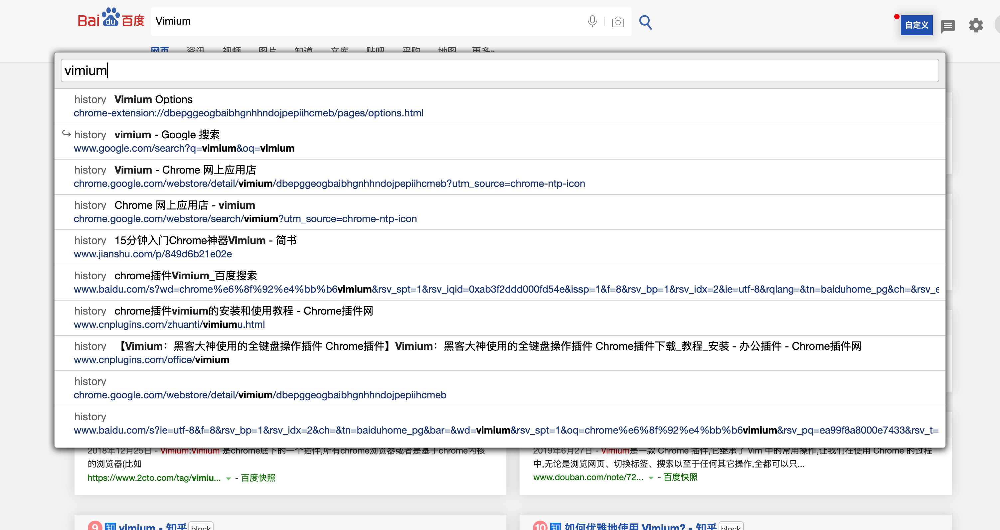

# 安利

## 前言

此文安利内容皆是我在使用的，我之所用，皆为精品，哈哈，并不是胡乱分享，觉得十分好用，就分享下，所以虽有花哨，却也实用


## Chrome插件

### 写在前面

作为一个正八经的前端，与chrome打交道必不可少，chrome扩展程序有很多，实用且好玩，我之前有段不务正业的时光，每天闲下来就喜欢找各种扩展，看着好玩就安装使用，不好用就卸载，后来还去看了看chrome扩展开发，还写了几个小扩展demo，对我而言，学习技术的动力是升职加薪，是不被淘汰，但是搞插件脚本这些东西则是我的兴趣，接下来为大家安利至今我依然觉得很好的几款chrome扩展


### No.1 GoogleHelper

谷歌上网助手，我就以Helper简称了，Helper是专门为科研、外贸、跨境电商、海淘人员、开发人员服务的上网加速工具，chrome内核浏览器专用!可以解决chrome扩展无法自动更新的问题，同时可>以访问谷歌google搜索，gmail邮箱，google+等谷歌产品

上面是官方解释，通俗来说，我们是不能访问谷歌的，需要翻墙，我们访问外网大多数其实只是使用谷歌搜索，或者是看国外的一些网站，翻墙好麻烦，作为21世纪有志青年，我们响应祖国的号召，科学文明上网，我们不翻墙，通过helper这个浏览器插件就可以让我们访问谷歌，查看外网的一些资源，这就足够了

##### 下载

安装谷歌插件没有翻墙的情况下我们我们进不去谷歌商店

所以可以直接搜索这个插件的官网下载 [GoogleHelper传送门](http://googlehelper.net/) 


如上所示，直接下载即可

##### 安装

2018年6月13日起,谷歌最新的Chrome 7 不再支持CRX手动安装方法，这样导至国内用户无法顺利安装Chrome扩展，大陆用户又无法访问Chrome应用商店，Helper提供了源码安装方式

这样导至国内用户无法顺利安装Chrome扩展

大陆用户又无法访问Chrome应用商店

我们提供了源码安装方式

**1.** 打开你的Chrome浏览器的 更多工具>扩展程序页面 ， 或者直接在网址输入: chrome://extensions/

**2.**在扩展程序右上角打开开发者选项，然后在此页面左上角点击 "添加已解压的扩展程序"

**3.**选择刚下载包里的 `ghelper_source` 目录

**4.**确认后就行了，装上源码包方式后，先登录，没有账号就注册下，免费的

**5.**最后回到第一步，进扩展程序页面，找到helper插件，点击插件详情，找到 `允许访问文件网址` 选项勾选同意

**6.**然后就能愉快访问谷歌了

##### 最后

我也用过其他的chrome上网加速插件，但是一番对比下来，还是helper好用


### No.2 OneTab & OneTab Plus

你是否经常因为打开的标签页太多，过于混乱而感到头疼，作为一个前端，每天打开无数的标签，有的是开发预览，有的是技术博客，管理起来是很麻烦的

OneTab Plus，一秒上手的傻瓜式操作，轻松管理所有标签页

之前我是使用OneTab的，很简洁，就是不太好看，后来看到了OneTab Plus，OneTab Plus毕竟是出自Infinity的产品，审美一直都是在线

安装的话，有了上面的helper插件，我们就可以直接在谷歌商店中搜索扩展安装了


点击添加至chrome即可一键安装

支持的功能有很多，整合标签组，分类归档等等，界面干净整洁，这里不介绍使用了，就是傻瓜式操作，安装一试便知

可能有些人觉得这种管理标签的插件不是必要的，但是我觉得不妨安装试一试，还是很香的


### No.3 FeHelper

FeHelper中文名为WEB前端助手，All In One的一个工具，包含多个独立小应用，比如：Json工具、代码美化、代码压缩、二维码、Postman、markdown、网页油猴、便签笔记、信息加密与解密、随机密码生成、Crontab等等

如下图


FeHelper的这些功能都很常用，总的来说，说是前端必备神器也不为过，所以强烈推荐，装上它还是很有用的

安装的话也同上，有了helper后直接去谷歌商店搜索FeHelper安装即可，使用简单，自己摸索吧

下图为商店中FeHelper


### No.4 Vimium

##### 简介

Vimium是Vim和 Chromium的结合，Vim是linux中让你脱离鼠标编辑文本的利器，同样Vimium是让你脱离鼠标就能上网的终极利器，不用移动鼠标就能跳转页面，切换标签，打开历史记录，打开书签等等，这比传统的鼠键结合的方式要快得多

总之，Vimium是极客必备，它可以让我们在浏览器中解放鼠标，效率与装逼集为一体，优雅而酷炫

作为一个经常和浏览器打交道的前端，这东西用之后有如神助，就很棒，极力推荐前端开发们使用，所以文中会细致介绍下

##### 安装

安装也同上，都是浏览器扩展插件嘛，有了helper后直接去谷歌商店搜索Vimium一键添加即可，就是下图这个


##### 使用

首先确保安装成功，浏览器右上角已经有了小图标

我们在浏览器打开一个新的标签页，搜索vimium回车，按下`f`键，当前页面的所有链接处都会分配快捷键，这也是最常用的vimium快捷键，效果如下图


分配的快捷键最多两个字符，也就是说我们最多只需按三下键盘，无需鼠标，想去哪就去哪

我们想要搜索内容时，只需按下`o`键，输入内容即可看到结果，同地址栏搜索一样方便简洁，想要在新标签页打开只需按下大写的`O`，搜索界面如下



我是一个喜欢把看到的好帖子收藏下来的人，所有收藏我都存在了谷歌书签，我自认为我的标签分类也算比较细致了，如下图


但是久而久之，收藏的东西太多了，不好查找，Vimium可以非常方便的帮我们查找标签页的内容

只需按下`b`键，即可模糊搜索收藏的标签页内容，界面效果和`o`键搜索一致，大写`B`键也是在新标签页打开，相信对喜欢收藏帖子加标签的人来说很实用

##### 快捷键一览

愉快的使用Vimium，下面这些快捷键必不可少，使用过Linux的vim的同学会感到毫无压力，没有使用过的同学记住常用的就OK了，当然这些快捷键都可以更改，但是建议不要更改，用熟后linux的vim也是这些操作

```js
j：		向下细微滚动窗口
k：		向上细微滚动窗口
J：		(Shift+j的意思，以下大写全部表示加Shift) 下一个标签页
K：		上一个标签页
d：		向下滚动半个屏幕
u：		向上移动半个屏幕
g+g：	同连续按两下g，回到顶部
G：		到达页面底部
H：		后退
L：		前进
f：		将当前网页上的所有可见链接/输入框分配一个快捷键，输入后就可以打开或者跳转到对应的输入框
F：		同f，只不过是将在新窗口中打开页面
g+i：	将光标 定位到输入框，如果有多个可以按Tab键切换
b：		搜索书签，当前页面打开
B：		搜索书签，新标签页打开
x：		关闭当前页面
X：		恢复刚刚关闭的页面
o：		相当于Chrome中的地址栏，搜索并在当前窗口打开，Chrome在全屏时也可使用
O：		同o，只不过是可以在新窗口中打开，很nice，Chrome在全屏时也可使用
g+s：	查看网页的源代码
r：		重新载入当前网页
```

**注：**浏览器自有页面该插件不可用，如控制台、默认的新标签页等等


##### 最后

没什么可说的，真是装逼神器，赶紧安装试试，安装后你可以尝试下不使用鼠标，仅使用键盘给这篇帖子评论个消息或者点个赞😄


### No.5 Saladict

Saladict 沙拉查词是一款专业划词翻译扩展，为交叉阅读而生。大量权威词典涵盖中英日韩法德西语，支持复杂的划词操作、网页翻译、生词本与 PDF 浏览

以上是官方解释，我认为，它的划词翻译最好，在浏览器中我们阅读外文，你是不是经常点谷歌翻译，谷歌翻译把整个网页翻译为中文，这样做我认为不太好，经常这样搞，英文水平永远也提不上去，而划词翻译不同，我们可以尝试阅读英文文档，遇到不会的直接选中单词或句子进行翻译，慢慢的英文水准就会有所提高

对比其他划词翻译插件我选择Saladict的原因有两点

1.界面相对漂亮，使用方便，作为前端，我认为它的交互体验非常nice

2.多渠道翻译更为精确

如下图所示


我们选中一句话或者一个单词，就会在对应位置自动弹出一个小图标，点击图标即可弹出对应多版本的翻译，使用及其方便，更多功能可安装后自行体验

安装方式还是从谷歌商店搜索Saladict一键安装即可，该插件如下


### No.6 Octotree

Octotree是一款针对github的插件，通常我们在浏览github时查看一个文件要进去，想查看其他文件就要返回在点入文件，比较麻烦，安装此插件，在我们浏览github时，它会为我们生成一个树形结构的侧边栏，这样我们在查看github项目时就不用点入点出，极为方便，如下图


此插件功能强大，但是如要使用更多功能，就需收费了，这点我觉得不太好，不过我们在不注册会员的情况下也可以使用它的树状侧边栏，如果你只需一个方便的侧边栏，那使用它就再好不过了

安装同上，谷歌商店中搜索扩展名Octotree，如下图，一键安装使用


### No.7 Sourcegraph

##### 简介

Sourcegraph又是一款为github而生的强大插件，它是一款可以为 Github 上的代码添加了即时文档和类型提示，并为每一个标识符添加了跳转到定义处的链接的Chrome 扩展，它允许你像使用一个很好的IDE 那样浏览源代码

我们看官方对它的解释

你可以从代码仓库和安装包甚至是函数里搜索代码，同时也可以直接点击被完全创建了链接的代码来阅读文档、跳转到变量定义或者马上找到可用的Demo。总而言之，你可以在你的web浏览器上完成这一切，而不需要配置任何编辑器。由Sourcegraph 出品的这款Chrome插件，可以非常方便的浏览和搜索Github上的代码，持跨repository搜索、跳转到定义、查找引用等功能，宛若一个功能强大的IDE。核心功能如跳转到定义(Go-to-definition)——浏览文件或查看pull请求时，将鼠标悬停在代码上可以查看文档提示，单击即可跳转到定义、查找引用或全文搜索

可能有人还是不了解它的强大，这样说吧，我们把github的项目克隆下来，在VSCode打开查看，和直接在github上打开感觉如何，这根本就不用比较，github上浏览项目代码很不方便，你只能像看文档一样查看，就像一个函数，我们要找这个函数定义所在，编译器里command+鼠标左击直接就进入函数内部了，github上是肯定不行的，而Sourcegraph可以帮你办到，说它是一款极简的线上IDE也不为过

##### 安装

安装如上一样，谷歌商店搜索扩展Sourcegraph安装即可，如下即是


##### 使用

安装好该插件后，我们再打开github项目，就会看到项目中出现了一个图标如下


点击该图标即可体验在线IDE的强大，它可以为我们浏览github优秀项目提供很大的助力

点击图标后进入界面如下


可能到了这里，有人会问，既然有Sourcegraph，那还要Octotree何用，Octotree的侧边栏，Sourcegraph也有

##### Octotree VS Sourcegraph

Octotree不需要跳转页面，就在github当前页面生成侧边栏，点击也是跳到对应的github地址下，使用极为方便，而Sourcegraph不同，它功能太过强大，所以打开会跳转到Sourcegraph.com上，打开速度和体验会稍稍有些不好，但是胜在功能强大

其实我之所以装两个，原因很简单，因为两者都可以用的上，一般我只是简单查看github项目时会使用Octotree，比较快捷，但是我想要深究其中一些内容，又不想克隆到本地时，会使用Sourcegraph，因为它更强大，函数查找，跳转定义简直不要太爽

有人可能说装这么多插件就算了，功能重叠的也装，这不是要累死谷歌，不急，看完你就知道了，咱有对策


### No.8 GitZip

GitZip，全名为GitZip for github，又是一款github神器，只要我们经常混迹github，那么它就更不可或缺了

我们都知道，要克隆一个仓库中的文件，我们要把整个仓库克隆下来，这点很不爽，毕竟一个仓库这么大，可能我只需要其中一两个文件，全部克隆过于麻烦

GitZip，有了它，你就不必烦恼这个问题

##### 安装

谷歌应用商店中搜索 GitZip，点击添加扩展即可，如下


##### 使用

找到一个github项目，这里以vue为例，我只想下载vue项目中的src文件夹，双击选中即可，如下图


我们只需要双击选中想要下载的文件夹或文件，左侧会出现对号代表选中，网页右下角会出现下载的箭头图标，我们点击箭头，即可打包下载选中文件

第一次使用此插件时，内心真的是翻江倒海，虽然功能并不强大，这个小功能正是我所需要的


### No.9 React Developer Tools

React Developer Tools这个就不介绍了，React调试插件，前端都知道


### No.10 Vue.js devtools

Vue.js devtools同React Developer Tools一样，vue调试插件，都是开发必备的，作为前端应该都知道，不介绍了


### No.11 掘金

掘金chrome扩展插件，大家在掘金首页上应该见过它，在那下载安装就成

为什么推荐它呢，可能有些人看到过它，只不过没注意，我之前偶尔空闲，看了一下官方的介绍，觉得好用，就装了，装之后体验非常棒，就一直留着了，功能很实用，界面很简洁

它会在你打开一个新的标签页时打开掘金插件定制好的内容聚合页面，你依然可以在地址栏搜索内容，不过映入眼帘的不再是空白的百度或谷歌，而是下图


如上图所示，打开一个新标签页，左侧会为你显示掘金的近期优质帖子，右边我们可以设置成github热门排行，当然这是我的选择，它不只是针对前端，后端和产品等不同人员皆可，自己选择感兴趣的东西即可

试想，每打开一个新的标签页，当日的github热门排行和掘金优质量帖子都会映入眼帘，我们可以在不知不觉中看到热门项目，帖子，如果感兴趣就点进去瞅瞅，这种内容聚合的创意我觉得很赞，大大节省了我刻意刷这些东西的时间


### No.12 GitHub Hovercard

##### 简介

GitHub Hovercard，一听名字就又是一款github相关的插件，它的作用是->鼠标悬停快速预览

浏览Github时我们浏览一个项目、一个用户的信息、或者一个issue，只能点击进去查看详情，如果经常浏览github的话，就有些麻烦了

GitHub Hovercard这个插件可以让我们快速浏览项目信息/用户信息/项目讨论，只需要吧鼠标悬停在想要查看的用户|项目|issue上就可以查看了，十分方便

##### 使用

下面是使用的一些截图

悬停在项目上时如下


悬停在用户上时如下


悬停在issue上时


悬浮在提交记录上时


总之，该插件对我们快速浏览项目帮助很大，我们每次要看一个详细信息就不用点击进去了，非常方便

##### 安装

谷歌商店搜索扩展名GitHub Hovercard添加至扩展即可，该插件如下


### No.13 Tampermonkey

#### 简介

Tampermonkey，大名顶顶的油猴，一个强大的脚本管理扩展，说是谷歌扩展中最强大插件也不为过，这个插件不装上都对不住那些熬夜写脚本的开发者们，你可能听说过油猴，但是因为看到脚本感到距离遥远望而却步，其实它的操作非常简单，只要经过简单设置，下载一些现成脚本，就可以实现超级实用的功能，你可能知道它，你也可能不知道它，不管怎样，今天看到之后，装上它就对了

#### 安装

谷歌应用商店搜索Tampermonkey扩展安装，该插件如下


#### 使用

只是安装油猴并无太大作用，重点是通过它管理脚本，此插件太好用了，所以一定要给大家安利上，尽量描述的详细些

安装油猴后，在浏览器地址栏右侧就会出现油猴的小图标，左击它，会有如下列表


##### 获取脚本渠道

首先我们要找几个脚本装一下，点击获取新脚本，会有如下页面


这里我们获取脚本的渠道有四，我们来看对比

- GreasyFork
  - GreasyFork是最受欢迎的后起之秀，它由 Jason Barnabe 创建
  - Jason Barnabe 同时也是 [Stylish](https://userstyles.org/) 网站的创办者，在其储存库中有大量的脚本资源
  - 这个库也是我们首推的脚本库，里面插件超级多，关键是可选择中文
  - 下文安装脚本会以此脚本库做示例
- OpenUserJS
  - GreasyFork 之后开始创办
  - 它由 Sizzle McTwizzle 创建,同样地,在其储存库中也拥有大量的脚本资源
  - 他是英文的
- Userscripts.org
  - 老牌脚本库，不过现在不更新了，不推荐使用
- GitHub/Gist
  - 当然也可以在github或gist中搜索脚本资源使用，我是没从这找过，我一般都用GreasyFork


##### GreasyFork中下载脚本

我一般都在GreasyFork中找脚本下着玩，里面的脚本足够用了

点击获取新脚本后，我们找到GreasyFork点击进入如下


我们点击右上角脚本列表，会看到无数的脚本资源，如下图


你也可以直接在搜索中输入关键字搜索脚本，我先随意下载一个做示例，就列表第一个吧，点击进入脚本详情

脚本的详情页会有对应的脚本使用介绍，看下就会用了


点击安装此脚本


再次点击安装即可，安装之后我们再次点击浏览器地址栏右侧油猴图标

选择管理面板点击进入，此时我们的油猴中就安装上一个脚本了，如下


如上图所示，我装的脚本不多，但是都挺好用的，推荐给大家

- id为5的是下载图库素材的脚本
  - 使用它之后下载图片资源，嘿嘿，那还开什么千图网vip

- id为1的百度谷歌去广告的脚本
  - 使用它之后，那百度和谷歌被净化的只剩文字，非常舒服
  - 还可以自己定制样式

- id为2的是CSDN博客免登陆，去广告，净化剪贴板的脚本
  - CSDN广告太多了，而且看博客时想复制代码粘贴老是携带CSDN注入的信息
  - 用了此脚本之后，嘿嘿

- id为3的是百度文档免费下载，粘贴的脚本
  - 有时候我们会找一些文档素材，百度文档不能复制，下载要会员
  - 有了此插件后，想复制下载，easy

- id为4的是视频vip解析脚本
  - 还开什么视频vip，想看啥，直接脚本搜即可


#### 最后

上面说这些玩法是非常普通的，Tampermonkey脚本管理工具玩法很多，脚本一途博大精深，有兴趣的话大家可以自己写脚本玩

下载的脚本安装后如何使用，一般在安装脚本的详情页会有对应的脚本使用介绍

脚本并不是都可用的，有些脚本收费，有的脚本则不可用

我下载的脚本并不多，更多好玩的脚本等着你去发掘

大家如果安装油猴了，到时候找到什么好玩免费的脚本，别忘了安利给我，先谢过


### No.14 SimpleExtManager

SimpleExtManager，将此扩展放到最后，意味着它是压轴的，上面说了这么多插件，有15款，都是我正在使用的，可能大家会说装这么多扩展，本来谷歌就吃内存，全都安装下来还能扛的住吗？

有些扩展我们只在特殊的场景下才会使用，但是我们启用禁用一个扩展需要到扩展中心，很麻烦

SimpleExtManager就是解决之道

它是一款快捷管理扩展的扩展插件，你可以使用该插件便捷管理扩展，快速打开扩展或关闭扩展

##### 安装

还是老样子，谷歌应用商店直接搜索扩展SimpleExtManager一键添加即可，该扩展在商店中如下


##### 使用

使用也非常简单

我们只需要点击地址栏对应的SimpleExtManager图标即可看到我们所有的扩展


如上图所示，禁用扩展直接取消选中即可，启用就勾选，还可快捷删除扩展

界面着实有点low，不过胜在简单实用


###小结

访问谷歌用helper

高效管理标签使用OneTab Plus

前端常用小工具FeHelper都有

不用鼠标，高效使用谷歌用Vimium

划词翻译用saladict

玩转Github，Octotree / Sourcegraph / GitZip / Github Hovercard四神器

Vue开发用Vue Devtools，react开发用React Developer Tools

掘金插件省去刻意查找的时间

油猴插件更是随心所欲，脚本爽到飞起

插件管理用SimpleExtManager

以上就是我安装并使用的15款非常nice的chrome扩展，大家如有更好的，请安利给我


## 代码截图


### No.1 carbon

[carbon](https://carbon.now.sh/)


### No.2 VS Code plugin CodeSnap


