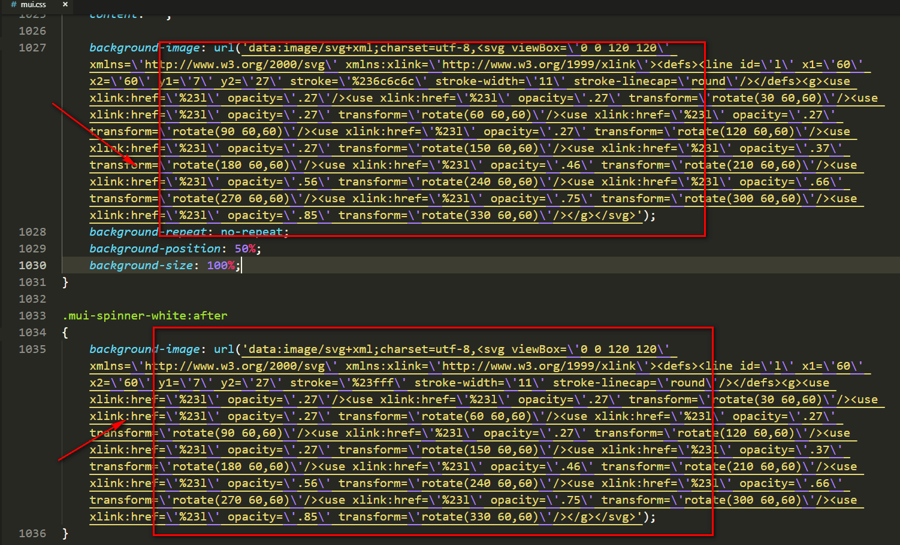

# Vue中npm run build报“Error in parsing SVG: Unquoted attribute value”


自己做的一个Vue项目，在打包时老是报这个错误

```js
# Error in parsing SVG: Unquoted attribute value
```

查了查网上说的，都说报错原因是压缩和抽离CSS的插件中只允许 SVG 使用双引号 

就是项目中外部引入的CSS文件里的SVG只能是双引号

我找了好久，这可把我坑坏了。。。

想想那段时间真是难受。。。

后来找到了，分享一下，让大家快点脱坑。。。


首先，如果你项目中使用了mui的话应该在这里改

找到mui文件下的iconfont.css文件

```js
# mui/css/iconfont.css
```


不要以为完了，还有

找到mui文件下的mui.css文件

```js
# mui/css/mui.css
```



以上两个文件修改了再次build

如果还报SVG的错误，请查看你所有引入的外部CSS文件吧

如果你确定你引入的CSS文件中确实没有SVG或者是SVG确实是双引号，那就没办法了老兄。。。

最后：喜欢前端，欢迎探讨！！！


> 如果对您有用，请点个star或关注下！谢谢
>
> 原创，转载请注明出处！
>
> 投诉建议邮箱：214930661@qq.com
>
> 关注请点击-GitHub:https://github.com/isboyjc

