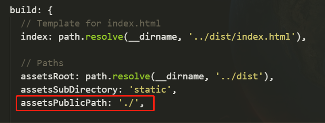
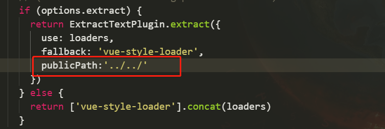

# Vue打包后静态资源路径错误

vue项目打包完了，dist文件也生成了，运行一下，又报错了

错误还不少，报了好多资源路径找不到的错误，大概有两种

- 一种是js或css文件引入路径错误，找不到文件
- 一种是css中的图片路径错误，找不到图片

#############################################

- js或css文件引入路径错误解决办法如下：

不知道大家发现没有，所有的路径错误都是少了个点，例如：

`src=/static/js/app.5d7099352641a1a9dd32.js `

知道原因了就找解决办法，手动加也行，不过为了每次打包完即用

在配置文件里改，一劳永逸

找到`config/index.js` 配置文件，找`build`打包对象里的`assetsPublicPath `属性

默认值为`/`，更改为`./`就好了

- css中的图片路径错误，找不到图片解决如下

在css里引入图片路径打包的时候路径会错

打开`build/utils.js`文件，把打包css文件的配置加一个打包路径即可

加一行代码，如下

> 如果对您有用，请点个star或关注下！谢谢
> 
> 原创，转载请注明出处！
> 
> 投诉建议邮箱：214930661@qq.com
> 
> 关注请点击-GitHub:https://github.com/isboyjc
