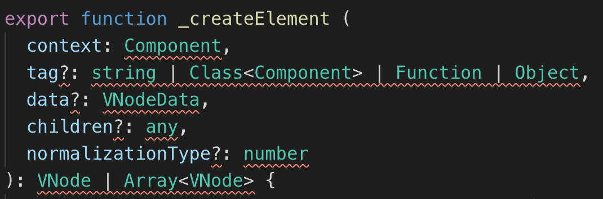

# Vue源码导读(一)--目录结构概览


### 前言


> 前端框架 , 不知道如何形容React的好 , 但是我个人更喜欢Vue一点 ,  作为Vue的爱好者和开发者 , 当然不能仅仅局限于使用Vue上 , 要了解Vue背后一系列的运行机制(数据驱动 , 数据更新 , 虚拟DOM , API实现等等) , 才能更好的掌握Vue , 而想要了解这些 , 最好的方式就是读源码
>
> 源码是很枯燥的 , 只是看很难理解 , 需要多动手实践 , 所以在此记录下在源码学习中的理解 , 持续更新
>
> 码字的过程中收集了很多零碎帖子参考 , 再加上自己的理解
>
> 所有涉及到的帖子会在每一节末列出来供大家阅读 , 码字不易 , 好文值得推荐
>
> 由于参考查阅的帖子太多，除却一些个人认为非常非常好的帖子(其实都很好), 不会全部列出(主要是太多了  , 只是这一篇帖子就参考了不下30篇帖子 , 学习看他们怎么写的有什么区别 , 来保证自己所写全面又无错 , 当然这个全面不是指的所有细节面面俱到 , 而是指除却vue核心源码外所涉及的知识体系我都会尽可能的做一个简述列出来为大家的源码学习标注下 , 还会提供我看过的优秀帖子 , 所学所写皆来自网上各位前辈的尽心输出 , 我也在尽我所能反馈更多的人 , 这就是一种十分理想互联网生态 , 既帮助自己巩固 , 又可以帮到他人 , 技术学习应当如此 ^-^ )
>
> 每一篇帖子都花费了大量时间 , 已极力保证无错 , 奈何本人水平有限 ,  如有不正 , 敬请指出 , 不喜勿喷 , 谢谢 , 进入正文


### 下载源码

在github克隆[Vue官方源码传送门](<https://github.com/vuejs/vue> )

当前克隆版本 : 2.6.10 


### 目录结构

#### 结构简述

打开克隆下的vue文件，我们会看到以下的目录结构

首先我们要了解这些文件都是干什么的，都有什么作用

```js
.circleci							# 包含CircleCI持续集成/持续部署工具的配置文件
.github								# 项目相关的说明文档
benchmarks/						# 性能测试文件,处理大量数据时测试demo
dist/									# 打包之后输出的不同版本Vue文件(UMD、CommonJS、ES 生产和开发包)
examples/							# 官方给出的实用demo案例代码
flow/									# flow数据类型声明文件
packages/							# 特定环境运行需要单独安装的包(weex,服务端渲染器等)
scripts/							# 打包的脚本配置文件(重:config.js),根据不同入口,打包不同文件
src/									# vue核心源码
test/									# 测试用例
types/								# 使用TypeScript定义的类型声明，并且包含了测试文件
.babelrc.js						# babel配置
.editorconfig					# 文本编码样式配置文件
.eslintignore					# eslint校验忽略文件
.eslinttrc.js					# eslint配置文件
.flowconfig						# flow配置文件
.gitignore						# git提交忽略文件配置
BACKERS.md						# 发起人和赞助者信息文件
LICENSE								# 项目开源协议
package.json					# 项目依赖及项目信息
REMADE.md							# 项目说明文件
yarn.lock|package-lock.json # 依赖的版本锁定文件
```


忽略项目中的一些配置，我门来细究其中几个重要文件夹的作用

#### benchmarks文件

benchmarks是性能测试文件，Vue的性能测试demo，比如大数据量的table或者渲染大量SVG，不做赘述


#### dist文件

##### 简述

dist文件夹中是打包之后输出的不同版本Vue文件

关于各种版本的作用，要在哪种情况下使用，dist目录下有REMADE.md说明文件，很详细，不过是比较官方的英文版，通俗中文版翻译如下

|                          | UMD                | CommonJS              | ES Module(基于构建工具使用) | ES Module(直接用于浏览器) |
| ------------------------ | ------------------ | --------------------- | --------------------------- | ------------------------- |
| 完整版                   | vue.js             | vue.common.js         | vue.esm.js                  | vue.esm.browser.js        |
| 只包含运行时版           | vue.runtime.js     | vue.runtime.common.js |                             |                           |
| 完整版(生产环境)         | vue.min.js         |                       |                             | vue.esm.browser.min.js    |
| 只包含运行时版(生产环境) | vue.runtime.min.js |                       |                             |                           |

##### 术语解释

**完整版(Full)**: 同时包含编译器和运行时的版本

**编译器(Compiler)**：用来将模板字符串编译成为 JavaScript 渲染函数的代码

**运行时(runtime)**： 用来创建 Vue 实例、渲染并处理虚拟 DOM 等的代码。基本上就是除了编译器其它都有

**UMD**：UMD 版本可以通过 `<script>标签直接用在浏览器中。` 位于https://Unpkg.com/vue的Unpkg CDN的默认文件vue.js运行时 + 编译器的 UMD 版本 (vue.js)

**CommonJS**：CommonJS 版本用来配合老的打包工具比如 Browserify 或 webpack 1。这些打包工具的默认文件 (`pkg.main`) 是只包含运行时的 CommonJS 版本 (`vue.runtime.common.js`) 

**ES Module**： 从 2.6 开始 Vue 会提供两个 ES Modules (ESM) 构建文件：

- 为打包工具提供的 ESM：为诸如 webpack 2 或 Rollup 提供的现代打包工具。ESM 格式被设计为可以被静态分析，所以打包工具可以利用这一点来进行“tree-shaking”将用不到的代码排除出。为这些打包工具提供的默认文件 (`pkg.module`) 是只有运行时的 ES Module 构建 (`vue.runtime.esm.js`)。
- 为浏览器提供的 ESM (2.6+)：用于在现代浏览器中通过 `<script type="module">` 直接导入


##### 运行时+编译器 vs 仅运行时

如果你需要动态编译模板（例如，使用项目中我们使用了template模板，或者使用其in-dom html作为模板安装到一个元素），那么就需要编译器把它编译

例如我们在cli或其他地方中使用vue loader或vueify时，*.vue文件中的模板在生成时会编译为js。打包好的js已经编译过了，我们就不需要编译器了，因此可以使用仅运行时的vue.js包。

例如我们老项目迭代开发中，在原生html中使用vue模版语法，在js中创建vue实例并挂载dom，使用cdn引入vue.js，这个时候需要对模版进行编译，那么我们就要使用带有编译器的版本(vue.js)

由于仅运行时的包比完整的包体积要轻30%，因此官方说应尽可能使用仅运行时


##### 开发(Development) vs 生产(Production)模式

开发/生产模式简单来说就是未压缩的文件用于开发，压缩后的文件用于生产

CommonJS和ES模块的包是为npm捆绑包设计的，因此官方没有为它们提供压缩版本，因为我们有使用到它们的场景时，使用完了肯定得自己打包，因为我们使用了npm捆绑包嘛 ，到最后就直接连同项目一块打包了，不需要压缩版本

commonjs和es模块构建还保留对process.env.node_env的原始检查，用以确定它们应该运行的模式。应该使用适当的绑定器配置来替换这些环境变量，方便控制将在哪种模式下运行Vue。用字符串文字替换process.env.NODE_env还允许像UglifyJS(可以理解为一个打包js的插件)这样的小型化程序完全删除仅用于开发的代码块，从而减少最终文件大小


#### examples文件

examples文件中存有vue官方的一些通用功能示例demo，有时间可以看下


#### flow文件

JavaScript 是一门动态类型语言，变量的类型是可以随时改变的，这种灵活性虽然可以使代码编写过程不用太多考虑类型的适配和转变，但是会提高在运行时产生错误的概率，这也是大多后端瞧不上js的一个点，说是js不严格啥的，我觉得挺好，嘿嘿

当然我们可以使用TS弥补这种短板，但是TS我们需要重新学习一套语言而且它还需要编译器把相应的代码编译成原生的 JavaScript 代码 ，成本较高

为了弥补这种不足，在`Vue`源码里，尤大采用了`Flow`作为静态类型检查，`Flow`是`facebook`出品的静态类型检查工具，在现有项目中加上类型标注后，可以在代码阶段就检测出对变量的不恰当使用，利用 Flow 进行类型检查，可以使项目代码更加健壮，确保项目的其他参与者也可以写出规范的代码

对比TS，Flow的优点

- 

flow文件就是做数据类型声明的，我们会经常看到下图中这种像是类型声明的代码



vue中使用flow做的类型校验，而这些类型统一在flow文件夹下定义

关于Flow的使用在这里不做赘述了，太麻烦，这里给大家粘一个知乎上关于Flow的帖子，看完包会那种，毕竟我这么笨的人都看的美滋滋，官方文档一并粘在下方

[Flow使用入门-知乎传送门](https://zhuanlan.zhihu.com/p/26204569)

[Flow官方文档传送门](https://flow.org/en/docs/getting-started/)

**另**: 了解了解就行了，毕竟vue3.0源码使用的Ts，哈哈


#### packages文件

packages文件夹下包含服务端渲染和模板编译器两种不同的NPM包，提供给不同使用场景使用


