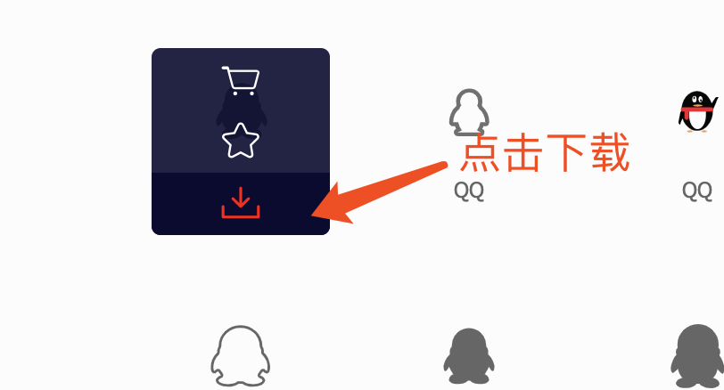
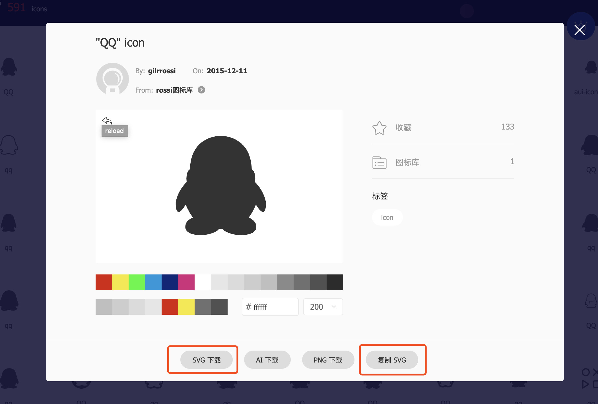

# Vue项目中优雅使用icon

### 前言

icon在我们前端日常开发中是很常用的，它有很多种使用方式，时至今日，它的使用方式经过了很多种演变，本文会为大家介绍icon的一些历史演变，分析一下这几种使用方式的优劣，我们将采用`svg sprites`这种方式使用icon，演示代码使用vue+vue-cli3+，看完之后，你会发现这种使用方式完全称得上优雅二字


### 追溯历史

#### Img标签引入

最早我们使用图标时只是单纯img标签引入图片，个人感觉也还好

但是这样网页上会有很多img图标的资源请求，这是它最大的缺点


#### 雪碧图(css sprites)

后来我们为了优化资源请求开始使用CSS雪碧图(css sprites)

CSS Sprites在国内很多人叫css精灵/css雪碧图(啥都行)，是一种网页图片应用处理方式。它允许你将一个页面涉及到的所有零星图片都包含到一张大图中去，这样一来，当访问该页面时，载入的图片就不会像以前那样一幅一幅地慢慢显示出来了。加速的关键，不是降低质量，而是减少个数

CSS Sprites其实就是把网页中一些背景图片整合到一张图片文件中，再利用CSS的`background-image background- repeat background-position`的组合进行背景定位，`background-position`可以用数字精确的定位出背景图片的位置

利用CSS Sprites能很好地减少网页的http请求，从而大大的提高页面的性能，这也是CSS Sprites最大的优点

同时它的缺点也很明显，CSS Sprites在开发的时候比较麻烦，需要计算基准位置来进行定位，维护的时候往往改动一个图标我们就得改整个雪碧图，一不小心就搞得整个网页的图标错位了


#### font库

再到后来就出现了font库，也就是字体图标库，它出现给了我们开发很大便利，使用起来也非常方便，字体图标为什么方便，因为我们可以直接从市面上的font字体图标库里找图标，直接使用，还可以很好的控制一些基础样式

国内估计使用量最大也是最全的图标库我觉得就是阿里矢量图标库(iconfont)了，各种图标简直不要太多，最重要的是开源免费

拿iconfont来说，它有三种使用方式，分别是`unicode，font-class，symbol`，都非常简单

font-class

symbol

当然，没有使用过的小伙伴直接百度搜索关键词iconfont使用，相信看一看就会了


接下来我们来看下这三种方式的优缺点(官方的)：


### font使用方式对比


#### unicode引用

------

unicode是字体在网页端最原始的应用方式，特点是：

- 兼容性最好，支持ie6+，及所有现代浏览器。
- 支持按字体的方式去动态调整图标大小，颜色等等。
- 但是因为是字体，所以不支持多色。只能使用平台里单色的图标，就算项目里有多色图标也会自动去色。

> 注意：新版iconfont支持多色图标，这些多色图标在unicode模式下将不能使用，如果有需求建议使用symbol的引用方式

unicode使用步骤如下：

##### 第一步：拷贝项目下面生成的font-face

```js
@font-face {font-family: 'iconfont';
    src: url('iconfont.eot');
    src: url('iconfont.eot?#iefix') format('embedded-opentype'),
    url('iconfont.woff') format('woff'),
    url('iconfont.ttf') format('truetype'),
    url('iconfont.svg#iconfont') format('svg');
}
```

##### 第二步：定义使用iconfont的样式

```js
.iconfont{
    font-family:"iconfont" !important;
    font-size:16px;font-style:normal;
    -webkit-font-smoothing: antialiased;
    -webkit-text-stroke-width: 0.2px;
    -moz-osx-font-smoothing: grayscale;}
```

##### 第三步：挑选相应图标并获取字体编码，应用于页面

```js
<i class="iconfont">&#x33;</i>
```


#### font-class引用

------

font-class是unicode使用方式的一种变种，主要是解决unicode书写不直观，语意不明确的问题。

与unicode使用方式相比，具有如下特点：

- 兼容性良好，支持ie8+，及所有现代浏览器。
- 相比于unicode语意明确，书写更直观。可以很容易分辨这个icon是什么。
- 因为使用class来定义图标，所以当要替换图标时，只需要修改class里面的unicode引用。
- 不过因为本质上还是使用的字体，所以多色图标还是不支持的。

使用步骤如下：

##### 第一步：拷贝项目下面生成的fontclass代码：

```js
//at.alicdn.com/t/font_8d5l8fzk5b87iudi.css
```

##### 第二步：挑选相应图标并获取类名，应用于页面：

```css
<i class="iconfont icon-xxx"></i>
```


#### symbol引用

------

这是一种全新的使用方式，应该说这才是未来的主流，也是平台目前推荐的用法。这种用法其实是做了一个svg的集合，与上面两种相比具有如下特点：

- 支持多色图标了，不再受单色限制。
- 通过一些技巧，支持像字体那样，通过`font-size`,`color`来调整样式。
- 兼容性较差，支持 ie9+,及现代浏览器。
- 浏览器渲染svg的性能一般，还不如png。

使用步骤如下：

##### 第一步：拷贝项目下面生成的symbol代码：

```js
//at.alicdn.com/t/font_8d5l8fzk5b87iudi.js
```

##### 第二步：加入通用css代码（引入一次就行）：

```js
<style type="text/css">
    .icon {
       width: 1em; height: 1em;
       vertical-align: -0.15em;
       fill: currentColor;
       overflow: hidden;
    }
</style>
```

##### 第三步：挑选相应图标并获取类名，应用于页面：

```js
<svg class="icon" aria-hidden="true">
    <use xlink:href="#icon-xxx"></use>
</svg>
```


以上三种使用姿势的优缺点相信大家都了解了，symbol这中使用方式就是本文的正题了，其实之前我是一直都使用font-class这种方式的(大家估计用这个的也很多)，但是它有点麻烦，因为我每次迭代项目时，修改或者添加图标都要去重新下载一份新的包，还不支持多色图标，但是现在我觉决定换了它，因为get到了一种更好的方式，它就是symbol

symbol它支持多色图标，兼容性到ie9+，这也没什么，毕竟某e浏览器差不多凉透了，浏览器渲染svg性能这个也可以不用担心，早在14年张鑫旭的一篇帖子 [SVG Sprite介绍](http://www.zhangxinxu.com/wordpress/2014/07/introduce-svg-sprite-technology/?spm=a313x.7781069.1998910419.50) 完美诠释了svg sprite的工作方式，并且对其很看好，或许这就是大佬的眼光吧 - _ -

单纯使用iconfont官方那种symbol方式其实是有点low的，实际开发中我们可以结合项目，让他变得简单，接下来我们就要进入本文正题，优雅使用icon了，哈哈哈，码这么多字，我太难了


### 项目中优雅使用icon

##### 搭建环境获取图标

我们使用vue-cli3搭建项目

怎么样才算优雅，首先我们在src目录下新建`icons/`文件夹，在`icons/`文件夹下建`svg/`文件夹，将来我们项目中的svg图标都会统一放在这里

接下来我们在官网搞来一个svg图标







点击svg下载到`icons/svg`目录下修改文件名为`qq.svg`，或者是在`icons/svg`目录下新建一个`qq.svg`文件，把复制的svg代码放进去也可以

这样就获取到了一个图标，很easy


##### 处理svg图标

vue-cli对svg文件有默认的`url-loader` 处理，我们要使用svg 图标需单独进行配置

下载一个插件`svg-sprite-loader`来单独处理我们的svg图标，它是一个webpack loader，支持将多个svg打包成svg sprites

npm下载

```js
npm install svg-sprite-loader -D
```

yarn下载

```js
yarn add svg-sprite-loader -D
```

我们要怎么使用它呢，首先我们不能覆盖原有的svg解析loader，我们只需要把`icons/svg`这个文件夹下的svg文件解析打包即可，我们在`vue.config.js`中chainWebpack函数中配置，来看代码

```js
module.exports = {
  // 一个函数，会接收一个基于 webpack-chain 的 ChainableConfig 实例
  // 允许对内部的 webpack 配置进行更细粒度的修改
	chainWebpack: config => {
    // 配置svg默认规则排除icons目录中svg文件处理
    config.module
      .rule("svg")
      .exclude.add(resolve("src/icons"))
      .end();

    // 新增icons规则，设置svg-sprite-loader处理icons目录中svg文件
    config.module
      .rule("icons")
      .test(/\.svg$/)
      .include.add(resolve("src/icons"))
      .end()
      .use("svg-sprite-loader")
      .loader("svg-sprite-loader")
      .options({ symbolId: "icon-[name]" })
      .end();
  }
}
```

如果我们不清楚cli的默认配置，怕改错，可通过vue inspect审查webpack内部配置，详细请看： [inspect使用](*https://cli.vuejs.org/zh/guide/webpack.html#%E5%AE%A1%E6%9F%A5%E9%A1%B9%E7%9B%AE%E7%9A%84-webpack-%E9%85%8D%E7%BD%AE*)

上面代码中我们使用了webpack的链式高级用法来处理loader，首先排除了默认svg的loader对我们`icons/`目录下svg文件的处理，然后新增了一个规则让`svg-sprite-loader`处理我们`icons/`文件夹下的svg文件，最后我们设置了`icon-`加上经过处理的svg文件名作为symbolId，也就是说我们在使用`qq.svg`时可以直接在use标签使用`#icon-qq`，关于链式操作不了解的小伙伴可以看: [链式操作(高级)]([https://cli.vuejs.org/zh/guide/webpack.html#%E9%93%BE%E5%BC%8F%E6%93%8D%E4%BD%9C-%E9%AB%98%E7%BA%A7](https://cli.vuejs.org/zh/guide/webpack.html#链式操作-高级)) 


##### svg sprites图标使用

现在我们就可以在你想使用图标的位置使用了，使用方式如下

在`main.js`中引入(全局引入)要使用的图标文件

```js
import "@/icons/svg/qq.svg";
```

模版中使用

```vue
<svg>
  <use xlink:href="#icon-qq"></use>
</svg>
```

你以为这就完了？不，还远远不够，这样使用一个图标就得引入文件一次也太麻烦了，接着看下文


##### 进阶-svg文件自动引入

知道为什么在`icons/`文件夹下还有一个存放svg文件的`svg/`文件夹吗，就是为了这一步自动化引入准备的，我们在`icons/`文件夹下新建`index.js`文件，两行代码搞定，内容如下

```js
// icons图标自动加载
const req = require.context("./svg", false, /\.svg$/);
req.keys().map(req);
```

上面代码中我们使用`require.context`设置了当前目录下的`./svg`文件为上下文，使用正则匹配了它需要检测的文件名，这样它就会在当前目录的svg文件夹下去匹配符合规则的文件名

然后我们使用`req.keys`拿到所有文件名数组，再使用map遍历加载req方法，这样当该文件被调用时会遍历加载所有匹配到的文件，这就很nice了

看看我们改进后的使用方法：

注释掉之前的代码，在`main.js`中引入`icons/index.js`文件

```js
import "@/icons/index.js";
```

模板中使用和上面一样，不过这次改进当我们再次下载了一个svg图标时，不用再引入一遍图标svg了，因为我们做了自动化，`icons/svg/`下的svg后缀图标文件都可被自动引入

```vue
<svg>
  <use xlink:href="#icon-qq"></use>
</svg>

<svg>
  <use xlink:href="#icon-wx"></use>
</svg>
...
```

是不是很方便，你以为结束了？不，我们还可以再简化，因为每次使用都得svg标签包着use太麻烦了，写着也不太雅观，我们继续简化，一定要看起来使用起来都十分优雅


##### 再进阶-SvgIcon组件

在`components/`目录下新建`SvgIcon/index.vue`文件，我们写一个svgicon组件，封装一下再全局注册，这样使用起来就会很方便了！

svg-icon组件代码如下：

```vue
<template>
  <svg :class="svgClass" aria-hidden="true" v-on="$listeners">
    <use :xlink:href="iconName" />
  </svg>
</template>
<script>
export default {
  name: "SvgIcon",
  props: {
    iconClass: {
      type: String,
      required: true
    },
    className: {
      type: String,
      default: ""
    }
  },
  computed: {
    iconName() {
      return `#icon-${this.iconClass}`;
    },
    svgClass() {
      if (this.className) {
        return "svg-icon " + this.className;
      } else {
        return "svg-icon";
      }
    }
  }
};
</script>
<style scoped>
.svg-icon {
  width: 1em;
  height: 1em;
  vertical-align: -0.15em;
  fill: currentColor;
  overflow: hidden;
}
</style>

```

当然组件内部我们还可以根据自身项目情况进行扩展，我这边写了基础的配置

组件写好了之后我们在`icons/index.js`中进行全局注册，这样我们只引入这一个文件就可以达到自动加载和组件注册两个功能

`icons/index.js`改进如下：

```js
import Vue from "vue";
import SvgIcon from "@/components/SvgIcon";

// icons图标自动加载
const req = require.context("./svg", false, /\.svg$/);
req.keys().map(req);

// 全局注册svg-icon组件
Vue.component("svg-icon", SvgIcon);

```

最后就是我们的使用了，在`main.js`文件引入`icons/index.js`

```js
import "@/icons/index.js";
```

再来看看我们使用图标的方法，组件中：

```vue
<template>
  <svg-icon icon-class="qq" class-name="qq-style"></svg-icon>
</template>
```

看，我们只用在`icon-class`中传入要使用的图标文件名就可以了，当然`class-name`还可以传入一个类，进行一些简单的样式修改，是不是很优雅，你get到了吗？


> 码字不易，动动小手，给个关注，点个赞啥的，哈哈
>
> 已尽量通俗解释，保证无措，奈何水平有限，欢迎指错
>
> 作者：isboyjc
>
> 邮箱：214930661@qq.com
>
> GitHub: https://github.com/isboyjc
>
> 参考文章：
>
> [未来必热：SVG Sprites技术介绍-张鑫旭](http://www.zhangxinxu.com/wordpress/2014/07/introduce-svg-sprite-technology/?spm=a313x.7781069.1998910419.50)
>
> [手摸手，带你优雅的使用 icon-掘金](https://juejin.im/post/59bb864b5188257e7a427c09)


