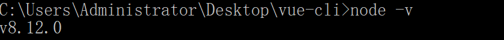
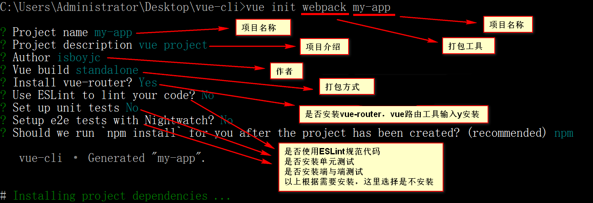
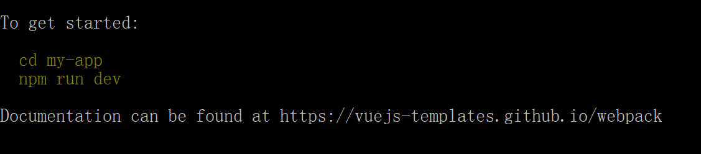
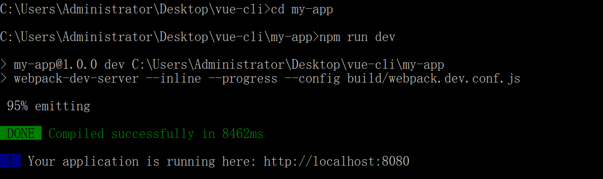
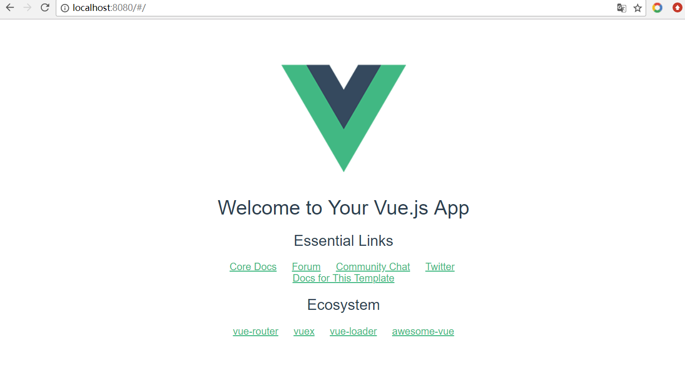

# Vue-cli构建流程


学习vue时，总觉得vue-cli搭建很复杂，其实也不过如此，使用别人搭建好的包在打包时总会报一些莫名其妙的错误，还是自己动手比较可靠，就像我总觉得我自己写的代码是最好的\^_^


首先，检测NodeJS环境

Windows+R快捷键打开cmd输入以下命令

```js
node -v
```

如果出现NodeJS的版本号，表示你已经安装了NodeJS



反之就是没有安装NodeJS了

安装NodeJS请走官网传送门

[传送门—NodeJS安装](https://nodejs.org/zh-cn/)

接下来就正式进入今天的主题脚手架搭建了

你可以使用npm安装，npm安装速度慢些（因为服务器在国外），你也可以使用淘宝的镜像安装 

安装淘宝镜像，打开cmd命令框，输入

```js
npm install -g cnpm –registry=https://registry.npm.taobao.org 
```

安装淘宝镜像之后把命令中的npm变成cnpm就可以了，我这里使用的是npm安装 (因为我觉得也慢不了多少)


全局安装Vue脚手架

```js
npm install -g vue-cli
```

安装成功之后cd进你的项目文件夹目录

初始化项目

```js
vue-init <template-name> [project-name]
# <template-name> —— 打包工具
# [project-name]  —— 项目名称 
```



回答完问题稍等片刻，初始化成功之后就会显示以下内容




然后根据提示cd进你的项目目录

输入`npm run dev`运行项目，如下




这个时候就可以在浏览器输入 `http://localhost:8080` ，出现以下界面脚手架搭建成功




以上就是vue-cli搭建的全部过程

脚手架项目结构

```js
├── build/                      # webpack 编译配置文件: 开发环境与生产环境
│   └── ...
├── config/                     
│   ├── index.js                # 项目核心配置
│   └── ...
├ ── node_module/               # 项目中安装的依赖包
   ── src/
│   ├── main.js                 # 项目入口文件
│   ├── App.vue                 # 项目入口vue组件
│   ├── components/             # 组件
│   │   └── ...
│   └── assets/                 # 资源文件，一般放一些静态资源
│       └── ...
├── static/                     # 纯静态资源 (打包时不会编译，会直接拷贝到dist/static/里面)
├── test/
│   └── unit/                   # 单元测试
│   │   ├── specs/              # 测试规范
│   │   ├── index.js            # 测试入口文件
│   │   └── karma.conf.js       # 测试运行配置文件
│   └── e2e/                    # 端到端测试
│   │   ├── specs/              # 测试规范
│   │   ├── custom-assertions/  # 端到端测试自定义断言
│   │   ├── runner.js           # 运行测试的脚本
│   │   └── nightwatch.conf.js  # 运行测试的配置文件
├── .babelrc                    # babel 配置文件
├── .editorconfig               # 编辑配置文件
├── .gitignore                  # 用来过滤一些版本控制的文件，比如node_modules文件夹 
├── index.html                  # index.html 项目模板入口文件
└── package.json                # 项目文件，记载项目依赖及项目说明（重） 
└── README.md                   # 说明文档，介绍自己的项目，markdown语法书写
```


最后项目打包请输入

```js
npm run bulid
```

打包完成后会在项目目录下生成一个dist文件

```js
├── dist/                     
│   ├── index.js                # 项目入口文件
│   └── static				   # 静态资源及打包后的一些js/css文件
```

详情待续。。。

最后：喜欢前端，欢迎探讨！！！ 

> 如果对您有用，请点个star或关注！谢谢
>
> 原创，转载请注明出处！
>
> 投诉建议邮箱：214930661@qq.com
>
> 关注请点击-GitHub:https://github.com/isboyjc


