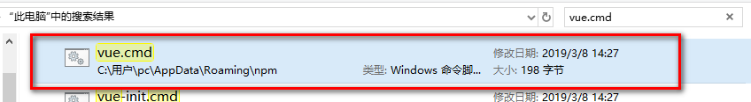
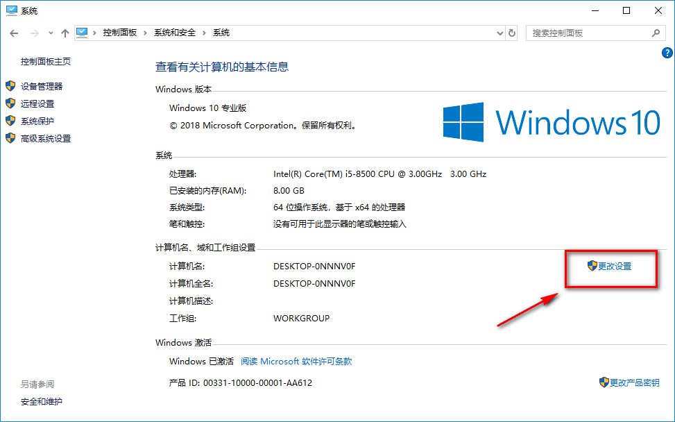
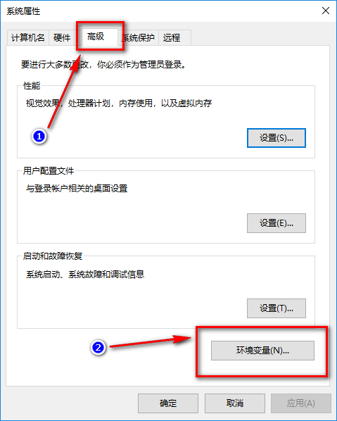
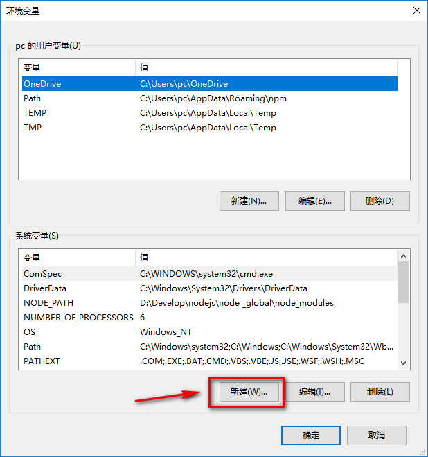
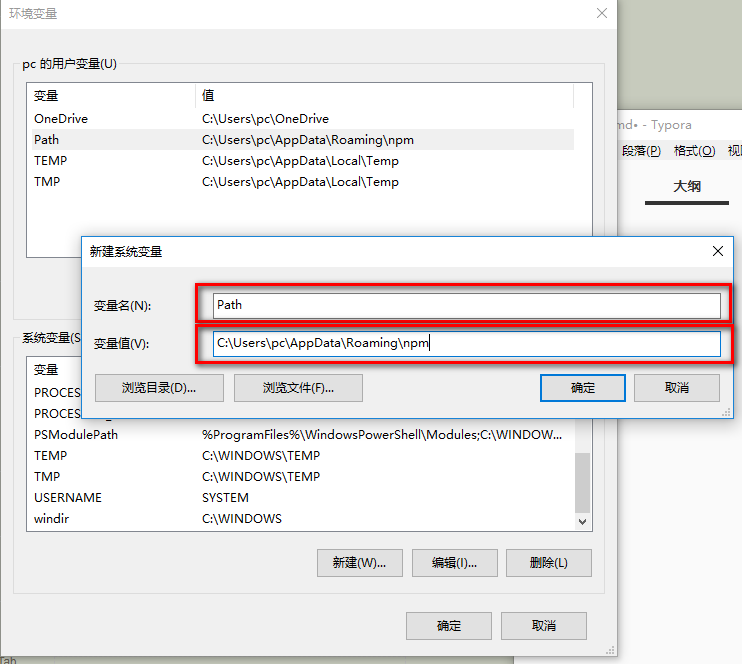

# vue不是内部或外部命令，也不是可执行的程序或批处理文件

平常我们搭个脚手架，可能分分钟就完事了，但是容易忽略一些细节，比如搭脚手架时cmd查vue版本号报`vue不是内部或外部命令，也不是可执行的程序或批处理文件`这种错误，明明vue下载了，脚手架下载完了怎么也初始化不了，你遇到过吗？

如果你确实已经在全局状态下安装了vue和vue-cli，cmd`vue -V`或`vue init`还是报这个错，嗯，有必要往下看看！

解决办法：

配置 vue 的环境变量 

- 搜索vue.cmd文件，复制该文件地址，待用
- 注：如果搜索不到，请再下载一遍vue。。

- windows下进入`控制面板\系统和安全\系统`点击更改设置

- 点击高级--环境变量

- 新建一个系统变量

- 输入变量名为Path，变量值为刚复制的vue.cmd文件路径

- 保存重新运行cmd输入`vue -V`即可

完美结束！！！

> 如果对您有用，请点个star或关注下！谢谢
>
> 原创，转载请注明出处！
>
> 投诉建议邮箱：214930661@qq.com
>
> 关注请点击-GitHub:https://github.com/isboyjc
